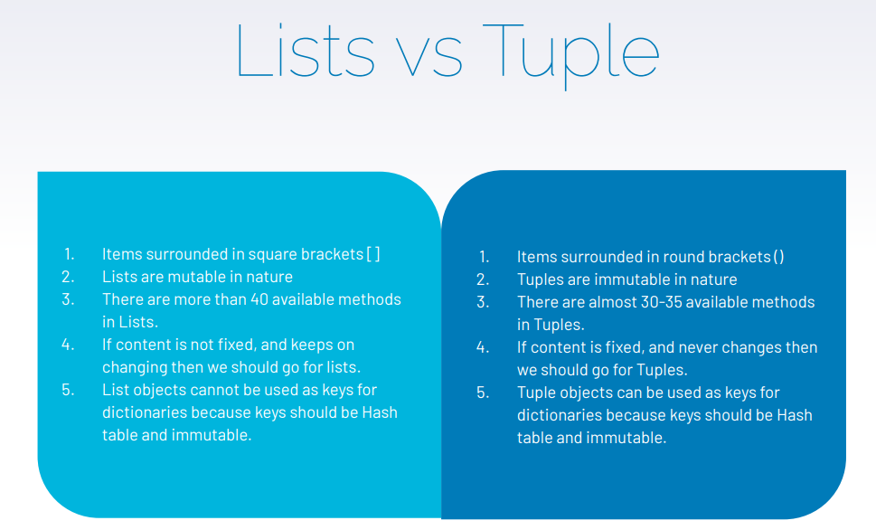

# Python (Basic to Intermediate)

Python is a general-purpose programming language that is often applied in scripting role.
*  Open Source general purpose programming 
  language.
*  Object Oriented.
*  Programming as well as scripting language.

 

### Feature
Easy to learn & use
▸ Interpreted language 
▸ Open Source 
▸ Large Standard Library 
▸ Large Community Support  
▸ Extensible 
▸ Cross-platform language
 
 

# Basics of Python

### Variable

You can consider a variable to be a temporary storage space where you can keep changing values.
Assigning values to a variable:
* To assign values to a variable in Python, we will use the assignment (=) operator.
a = 10, a = “Welcome to the class”
* No need to declare the datatype of the variables done in other programming languages
 

### Keywords
 Special reserved words which convey a special meaning to interpreter or compiler. 
* It can’t be used as a variable.
* Few of the example keywords are as follows:
 def, else, if, class, continue, break, finally, 
 from, return, lambda, except, import, None

### Datatypes

  

### Operators & Operands

Operators are special symbols that represent computations like addition and multiplication. 
* Value of operators is applied to are called 
operands.
*  Operator : -, +, /,*,**
   20+32, hour-1, hour*60+minute 5**2

- Order of Precedence : PEMD (Parenthesis, 
Exponentiation, Multiplication and Operators)

  

# Python Data Structure

#### List

* List is a sequence of values of any type. 
* Values in lists are called as elements or items.
  [10, 20, ‘Class’]
* A list within another list is nested.
* Lists are mutable.
* It has variable length.
* Lists are accessed similarly like arrays. First element will be stored at 0th index.
  

#### Tuple

Tuples are similar like lists, having a sequence of values of any type and enclosed within parentheses.
* Tuples are immutable.
* It has fixed length.
* tup_1 = (‘a’, 1, ‘df’, ‘b’)
  

To Find the Major difference between List and Tuple.Image below explain it.

  

#### Sets

Unordered collection of items is known as set.
* Items of set can not be duplicate.
Colors = { ‘red’, ‘blue’ , ‘green’ }
* Let’s see how to use, Union, Intersection methods 
in set.

#### Dictionary

* Unordered collection of data.
* Data in dictionary is stored as key:value pair.
* Key should not be mutable and value can be of any type.
* Dict = { “name”: “begindatum”, ‘age’:10 }
Keys: name and age
Values: begindatum and 10
  

# Python Loops,Functions and File Handling

#### Loops

● For loop
for index in sequence:
 statements
for i in range(1,10):
 print(i)
for i in range(0,5): 
    print(i) 
else:
     print("for loop completely exhausted, since there is no break."); 

 Once for loop is executed, else block is also executed. 

#### Functions
Function is a named-sequence of statements that performs some operations. 
Example: type(32)
Here, name of function is type and expression in 
parenthesis is called argument of the function.
● Type Conversion Function : Convert values from one type 
to another. Int can convert floating-point values to 
integers and vice-versa
int(3.4545)
output:3 

#### Lambda Function
▸ Lambda Function is a small anonymous function which 
makes the developer’s life easier 
▸ It can take any number of arguments, but can only have 
one expression. 
##### Syntax : Lambda arguments: expression
The Expression is executed and the result is return
 

#### Map, Reduce & Filter
It is  Utility function, maps a collection to another collection object based on certain functionality.
map(function, iterable object)
For example: If we have list of people like: 
firstname = ["Ram", "Shyam", "Vinay", "Gopal"]
▸ Map the list to obtain the names in upper case
▸ list(map(lambda x:x.upper(), firstname)
 

#### File Handling
● Let’s see how to read and write with the files in Python. We will use 
basic functions and methods like open(), read(), close() to perform 
the file manipulation. 
● file object = open(file_name [, access_mode][, buffering]) 
Fileopen = open(“filename”, “r”) 
Fileopen.close() 
Fileopen.read() 
Fileopen.readline() // Read lines of the file 
Fileopen.write(“Welcome to the class”) 
 

You can see my notebook. All  the work is explained in detail.

### AUTHOR

<strong>Shehryar Gondal</strong>

You can get in touch with me on my LinkedIn Profile: 

You can also follow my GitHub Profile to stay updated about my latest projects: 

If you liked the repo then kindly support it by giving it a star ⭐.
